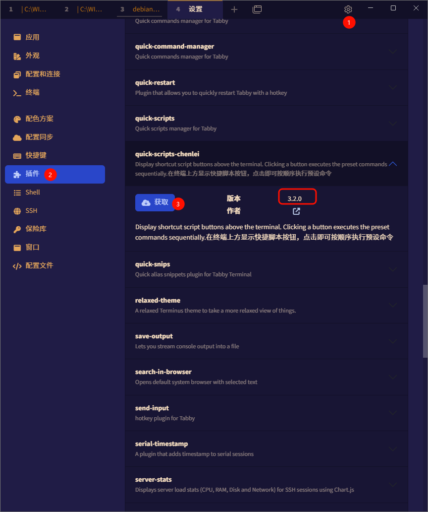
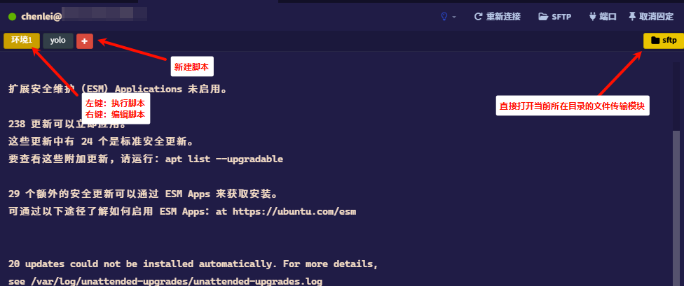
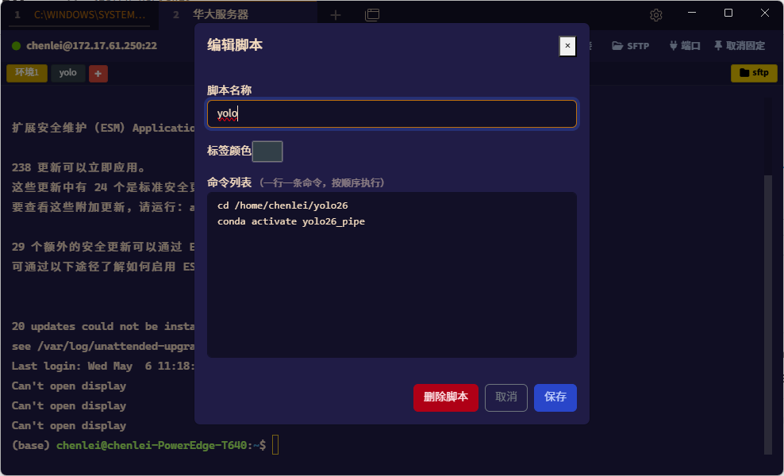
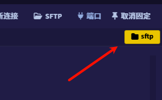
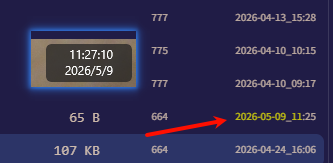
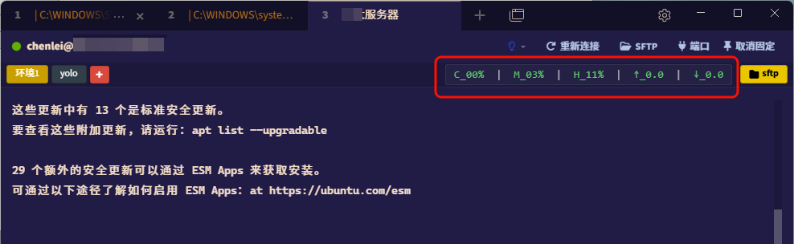

# 🚀 Tabby Quick Scripts 插件

[](https://github.com/Eugeny/tabby)
[](https://github.com/clhome/tabby--QuickScripts)
[](LICENSE)

[English Version](readme.md)


`tabby-quick-scripts` 是一款专为 **[Tabby 终端](https://github.com/Eugeny/tabby)** 量身定制的增强型插件。它通过在标签页上方注入一个快捷工具栏，帮助用户高效管理并一键执行多行预设命令，同时集成了强大的 SFTP 辅助功能。

---

## ✨ 核心特性

*   **⚡ 快捷脚本工具栏**：在 SSH、Serial、Telnet 等终端面板顶部显示常驻按钮。
*   **🤖 智能顺序执行**：支持多行命令按序发送。内置提示符检测（`$`, `#`, `>`, `%`），确保上一条命令响应完成后再发送下一条，避免指令堆叠。
*   **📂 增强版 SFTP 模块**：
    *   **目录自动同步**：打开 SFTP 面板时，远程端自动跳转至当前终端的工作路径。
    *   **双端路径收藏**：支持对本地和远程常用路径进行收藏，实现快速跳转。
    *   **智能时间高亮**：文件修改时间（年月日时分）若与当前系统时间匹配，将自动以 **绿色/黄色** 高亮显示，助你瞬间锁定最新生成的日志或文件。
    *   **原生拖拽支持**：支持文件/文件夹在左右面板间拖拽传输，或从系统文件夹直接拖入。
*   **🎨 可视化管理**：
    *   **新建**：点击工具栏右侧的 `+` 号即可快速创建。
    *   **执行**：左键单击脚本按钮一键运行。
    *   **管理**：右键单击按钮进入编辑模式，支持颜色自定义与顺序调整。
*   **🖥️ 实时服务器资源监控**：在工具栏右侧显示醒目的资源监控条，通过独立 SSH 通道实时获取 CPU、内存、磁盘占用及网络上下行速度（Mbps）。

---

## 📦 安装方式

### 方式一：官方插件市场安装（推荐）

1.  打开 Tabby 的 **Settings** -> **Plugins**。
2.  在搜索框输入 `tabby-quick-scripts-chenlei`。
3.  点击 **Install** 按钮，安装完成后重启 Tabby 即可。



---

## 📖 使用指南

### 1. 快捷脚本管理
*   **左键点击**：立即触发脚本执行。
*   **右键点击**：唤起编辑模态框，修改指令或删除脚本。





### 2. SFTP 增强模块
点击终端右上角的 **`SFTP`** 按钮开启增强面板。



*   **路径收藏**：点击星号图标即可收藏当前路径，通过右侧下拉菜单快速切换。
*   **时间匹配**：如下图所示，年月日及小时与当前匹配的部分将呈现醒目的颜色。



### 3. 实时服务器资源监控（ver3.0新增功能）
监控栏显示远程 Linux 服务器的实时运行状态（默认每 5 秒刷新一次）。

*   **📊 显示指标**：`CPU (C)`、`内存 (M)`、`磁盘 (H)` 以及 `实时网速 (↑/↓ Mbps)`。
*   **🌈 颜色预警**：
    *   **CPU/内存/磁盘**：`0-50%` 绿色，`51-80%` 黄色，`>80%` 红色。
    *   **实时网速**：`0-1 Mbps` 绿色，`1-5 Mbps` 黄色，`>5 Mbps` 红色。
*   **✨ 视觉防抖**：百分比数值小于 10% 时自动补零（如 `05%`），网速固定显示 1 位小数，确保界面文字不左右跳动。
*   **⚡ 手动刷新**：点击监控栏区域可立即触发一次手动数据采集。
*   **🛡️ 非侵入式**：采用独立的 SSH EXEC 通道采集数据，完全不干扰、不污染您的终端输入界面。



---

## 🛠️ 本地开发与源码安装

如果你需要手动安装或进行二次开发：

### 1. 插件存放路径
*   **Windows**: `%APPDATA%\tabby\plugins\node_modules\`
*   **macOS**: `~/Library/Application Support/tabby/plugins/node_modules/`
*   **Linux**: `~/.config/tabby/plugins/node_modules/`

### 2. 软链接部署（推荐）
在 `node_modules` 目录下创建指向本项目源码的软链接，无需反复拷贝。

**PowerShell (管理员权限):**
```powershell
# 请确保 -Target 后的路径为您本地源码的真实路径
New-Item -ItemType SymbolicLink -Path "$env:APPDATA\tabby\plugins\node_modules\tabby-quick-scripts" -Target "F:\git\gitea20250909\tabby--QuickScripts"
```

### 3. 构建命令
```bash
# 安装依赖
npm install

# 生产环境编译
npm run build

# 开发监听模式（实时编译）
npm run watch
```

> [!IMPORTANT]
> **注意**：无论是商店安装还是手动部署，配置完成后必须 **完全退出并重新启动 Tabby** 才能使插件生效。

---

## ⚙️ 高级配置 (config.yaml)

你可以通过修改 Tabby 的全局配置文件 `config.yaml` 来微调脚本执行逻辑：

```yaml
quickScriptsPlugin:
  promptPattern: '(\$|#|>|%)\s*$'  # 判断上一条命令结束的正则匹配式
  commandTimeout: 30000             # 单条命令超时等待上限 (ms)
  minDelay: 500                     # 发送命令之间的最小物理安全延迟 (ms)
  enableSysMonitor: true            # 是否启用实时资源监控
  sysMonitorInterval: 5000          # 监控刷新间隔时间 (ms)
```

---

## 📄 开源协议
基于 [MIT](LICENSE) 协议开源。

## 🌟 Star History


[](https://www.star-history.com/#clhome/tabby--QuickScripts&type=date&legend=top-left)
