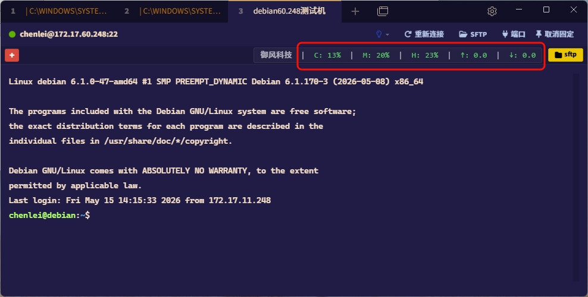

# 🚀 Tabby Quick Scripts 插件

[](https://github.com/Eugeny/tabby)
[](https://github.com/clhome/tabby--QuickScripts)
[](LICENSE)

[English Version](readme.md)


`tabby-quick-scripts` 是一款专为 **[Tabby 终端](https://github.com/Eugeny/tabby)** 量身定制的增强型插件。它通过在标签页上方注入一个快捷工具栏，帮助用户高效管理并一键执行多行预设命令，同时集成了强大的 SFTP 辅助功能。

> [!WARNING]
> ### ⚠️ 强烈建议您更新到 3.4 之后的版本！
> 之前版本存在**内存泄露风险**，在特殊情况或长时间运行下会导致 Tabby 界面卡顿、变慢。
> 后续版本对插件底层通信、定时器机制和页面生命周期进行了**底层重构与深度优化**，彻底解决了该潜在问题！强烈建议所有用户尽快升级。
>
> **📢 3.4+ 底层重构与主要优化内容：**
> 1. **🔧 底层重构与内存防泄露**：重新设计了 SSH 连接通道与定时器的生命周期，彻底修复了长连接中监控定时数据及通道堆积的问题，确保客户端长时间稳定流畅。
> 2. **📂 SFTP 体验跃升**：新引入了远程文件“八进制权限（Perms）”和“所有者（Owner）”列的渲染显示，并支持图形化二次确认修改文件权限。
> 3. **🗺️ 路径同步与防丢面包屑**：重构了远程目录跳转逻辑（`goToRemotePath`），统一在首次连接及切换收藏夹路径时自适应更新导航面包屑，路径显示更稳定。
> 4. **🔎 排序与时间智能高亮**：支持根据本地/远程修改时间进行降序排列，智能高亮与当前时间一致的年月日或时分秒字符，助力精准快速搜寻文件。
> 5. **🌐 界面国际化适配**：全项目交互组件全面支持中英文无缝双语自适应。

---

## ✨ 核心特性

- **⚡ 快捷脚本工具栏**：在 SSH、Serial、Telnet 等终端面板顶部显示常驻按钮。
- **🤖 智能顺序执行**：支持多行命令按序发送。内置提示符检测（`$`, `#`, `>`, `%`），确保上一条命令响应完成后再发送下一条，避免指令堆叠。
- **📂 增强版 SFTP 模块**：
  - **性能极致优化**：采用并发 I/O 模式，支持拥有数百个文件的文件夹秒级加载，彻底解决 UI 卡顿。
  - **Windows 盘符快速切换**：在 Windows 下左键点击路径栏首个盘符（如 `C:`）即可弹出本地磁盘下拉菜单。
  - **智能默认路径**：Windows 下首次打开自动定位至本机最后一个本地磁盘根目录，方便快速访问。
  - **精细化时间高亮**：支持对年、月、日、时、分分别进行高亮匹配，助你瞬间锁定最新文件。
  - **原生操作体验**：支持双端路径收藏、按钮点击物理反馈、以及流畅的文件拖拽传输。
- **🎨 可视化管理**：
  - **新建**：点击工具栏右侧的 `+` 号即可快速创建。
  - **执行**：左键单击脚本按钮一键运行。
  - **管理**：右键单击按钮进入编辑模式，支持颜色自定义与顺序调整。
- **🖥️ 实时服务器资源监控**：
  - **高精度采样**：采用双重采样算法规避 `top` 命令启动毛刺，提供更精准的瞬时 CPU 使用率。
  - **稳定性增强**：彻底修复 SSH 通道与定时器泄露问题，确保持续运行不增加系统负担。
  - **可视化指标**：实时显示 CPU、内存、磁盘占用及网络上下行速度（Mbps）。

---

## 📦 安装方式

### 方式一：官方插件市场安装（推荐）

1.  打开 Tabby 的 **Settings** -> **Plugins**。
2.  找到插件： `tabby-quick-scripts-chenlei`。
3.  点击 **Install** 按钮，安装完成后重启 Tabby 即可。


---

## 📖 使用指南

### 1. 快捷脚本管理

- **左键点击**：立即触发脚本执行。
- **右键点击**：唤起编辑模态框，修改指令或删除脚本。


### 2. SFTP 增强模块

点击终端右上角的 **`SFTP`** 按钮开启增强面板。


- **路径收藏**：点击星号图标即可收藏当前路径，通过右侧下拉菜单快速切换。
- **时间匹配**：如下图所示，年月日及小时与当前匹配的部分将呈现醒目的颜色。


### 3. 实时服务器资源监控（ver3.0新增功能）

监控栏显示远程 Linux 服务器的实时运行状态（默认每 5 秒刷新一次）。

- **📊 显示指标**：`CPU (C)`、`内存 (M)`、`磁盘 (H)` 以及 `实时网速 (↑/↓ Mbps)`。
- **🌈 颜色预警**：
  - **CPU/内存/磁盘**：`0-50%` 绿色，`51-80%` 黄色，`>80%` 红色。
  - **实时网速**：`0-1 Mbps` 绿色，`1-5 Mbps` 黄色，`>5 Mbps` 红色。
- **✨ 视觉防抖**：百分比数值小于 10% 时自动补零（如 `05%`），网速固定显示 1 位小数，确保界面文字不左右跳动。
- **⚡ 手动刷新**：点击监控栏区域可立即触发一次手动数据采集。
- **🛡️ 非侵入式**：采用独立的 SSH EXEC 通道采集数据，完全不干扰、不污染您的终端输入界面。



---

## 🛠️ 本地开发与源码安装

如果你需要手动安装或进行二次开发：

### 1. 插件存放路径

- **Windows**: `%APPDATA%\tabby\plugins\node_modules\`
- **macOS**: `~/Library/Application Support/tabby/plugins/node_modules/`
- **Linux**: `~/.config/tabby/plugins/node_modules/`

### 2. 软链接部署（推荐）

在 `node_modules` 目录下创建指向本项目源码的软链接，无需反复拷贝。

**PowerShell (管理员权限):**

```powershell
# 请确保 -Target 后的路径为您本地源码的真实路径
New-Item -ItemType SymbolicLink -Path "$env:APPDATA\tabby\plugins\node_modules\tabby-quick-scripts" -Target "F:\git\gitea20250909\tabby--QuickScripts"
```

### 3. 构建命令

```bash
# 安装依赖
npm install

# 生产环境编译
npm run build

# 开发监听模式（实时编译）
npm run watch
```

> [!IMPORTANT]
> **注意**：无论是商店安装还是手动部署，配置完成后必须 **完全退出并重新启动 Tabby** 才能使插件生效。

---

## ⚙️ 高级配置 (config.yaml)

你可以通过修改 Tabby 的全局配置文件 `config.yaml` 来微调脚本执行逻辑：

```yaml
quickScriptsPlugin:
  promptPattern: '(\$|#|>|%)\s*$' # 判断上一条命令结束的正则匹配式
  commandTimeout: 30000 # 单条命令超时等待上限 (ms)
  minDelay: 500 # 发送命令之间的最小物理安全延迟 (ms)
  enableSysMonitor: true # 是否启用实时资源监控
  sysMonitorInterval: 5000 # 监控刷新间隔时间 (ms)
```

---

## 📄 开源协议

基于 [MIT](LICENSE) 协议开源。

## 🌟 Star History

[](https://www.star-history.com/#clhome/tabby--QuickScripts&type=date&legend=top-left)
